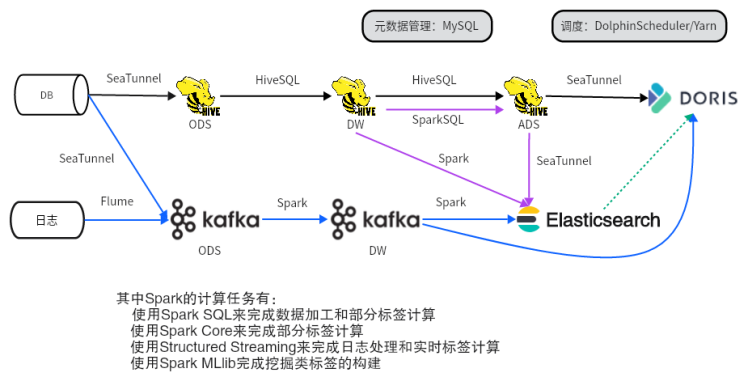

# 云鲜智购用户画像与推荐系统
> 电商标签体系 + 实时计算 + 推荐系统

**项目背景**：基于离线数仓数据搭建用户画像三级标签体系与推荐系统，实现用户精准划分与个性化营销，提升用户粘性与平台销量 
**技术架构**：Spark + Hive + Elasticsearch + Kafka + Flume + SeaTunnel + Doris + DolphinScheduler + FineBI 
**数据流转**： 
 
**可视化结果展示**： 

